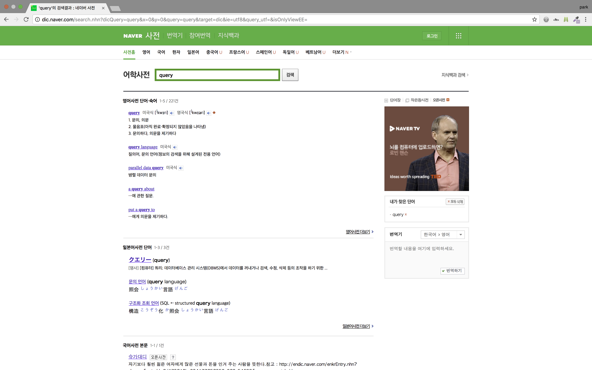

저와 같이 이제 막 개발공부를 시작했다면, 어려운 점 중 하나가 개발용어를 이해하는 부분 일 것 입니다. node.js, npm, routing, Framework, library 등등...

저도 아직 현업에서 개발자로 일해 본 경험이 없기때문에 와 닿지 않은 개념이 많이 있습니다. 하지만 최소한 감이라도 잡을 수 있게 현업개발자에게 배운 개발용어 공부하는 법을 공유하려고 합니다.

0. 영문으로 검색하기
   - 웬만한 최신 자료는 모두 영어로 되어 있기때문에, 앞으로 개발자로 살아가기 위해서는 영어와 친해지셔야 합니다.

1. Google Imgae 검색

   * 제가 모르는 개발용어가 나왔을 때 가장 먼저하는 것이 `구글이미지 검색`입니다. 왜냐하면 문자로 보는 것보다 이미지로 보는 것이 직관적이기 때문입니다.

   ​

   * 예를 들어, Framework와 library의 차이점이 궁금하다면 `Framework vs library `, `framework library`와 같이 검색을 하면 아래와 같은 여러 이미지가 나옵니다.

     검색 결과 중에 공통된 이미지거나 직관적으로 느껴지는 이미지를 봅니다.

     code를 call하는 주체에 따라 Framwork와 library로 구분된다고 하네요.

   

2. 개발용어 번역하기

   - 영문으로 된 개발용어를 한글로 변역하면 용어가 내포하는 의미를 알 수 있다.

   - 예를 들어, query에 대해 들어봤다고 가정을 해보자. 보통  query를 날린다는 말을 많이 사용한다.

     네이버 사전에 따르면, query는  `1) 문의, 의문 2)물음표(아직 완료・확정되지 않았음을 나타냄) 3) 문의하다, 의문을 제기하다` 와 같은 내용을 뜻한다고 합니다.

     정확히는 모르겠지만 query는 무언가 궁금한 것 혹은 의문이 있는 것을 요청한다고 볼 수 있겠네요.

     

3. Google 검색

   - 1번과 2번을 통해 개발 용어에 대한 (아주 작은)감을 잡으셨다면, 그 다음에 구글링 하면서 웹문서를 읽으신다면 개념을 정리하는데 조금은 편하실 겁니다.

4. Youtube 검색

   - 글과 이미지로 느낌이 안온다면 Youtube에 영상도 찾아보는 것을 추천합니다. Google 검색과 같이 영문으로 해주실 것을 추천드립니다.
