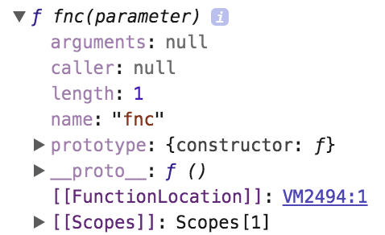

# javascript
* 절차형, 명령형, 함수형, 객체지향형 javascript가 있다.

### 함수선언식(Function declaration) VS 함수표현식(Function expression)

#### 함수선언식(Function declaration)

```javascript
function square(number) {
  return number * number;
} // ; 으로 끝나지 않는다.(문법)
```

#### 함수표현식(Function expression)

```javascript
var square = function(number) {
  return number * number;
}; // ; 으로 끝 맺는다. (문법)
```

### hoisting
* 선언문이 코드 선두에 옮겨진 것처럼 작동하는 것.

#### 변수 hoisting
* 선언, 초기화가 한번에 이뤄진다.
* 함수 표현식도 변수 hoisting이 이뤄진다. 변수에 함수를 값으로 할당하기 때문이다. (선언 이전에 호출 불가능)

#### 함수 hoisting
* 함수 선언, 초기화, 할당이 한번에 이뤄진다. (선언 이전에 호출 가능)

### First-class object
* 무명의 리터럴로 표현 가능하다.
* 변수, 객체, 배열 등에 저장할 수 있다 .
* 함수의 파라미터로 전달 할 수 있다.
* return value로 사용할 수 있다.

### console.dir
* 비표준.
* 객체의 내부까지 들여다 볼 수 있는 함수.

### function object property

```javascript
function fnc(parameter) {
  return paremeter;
}
console.dir(fnc);
```


* arguments property
  * 가변인자함수 일때, argument로 전달받는 갯수를 유사배열 객체로 저장하는 property.
  * 함수 바디에서 지역변수처럼 사용 가능.

```javascript
// arguments 사용법

function fnc(parameter) {
  console.log(arguments);
  return paremeter;
};

fnc(1);       // { '0': 1 }
fnc(1, 2);    // { '0': 1, '1': 2 }
fnc(1, 2, 3); // { '0': 1, '1': 2, '2': 3 }
```

* caller
  * 함수를 부른 주체.
  * ex. 콜백함수를 가지는 함수.

* length
  * parameter의 갯수.

* name
  * 함수의 이름.

* __prototype__
  * ECMAScript 스펙에서는 [[prototype]]으로 명시되어 있지만 크롬에서는 __prototype__으로 지정함.
  * 부모역할을 하는 prototype 객체와 연결해주는 property.

* prototype
  * 생성자함수 혹은 함수만 가진다.
  * 함수 객체의 Prototype와 연결해주는 property.